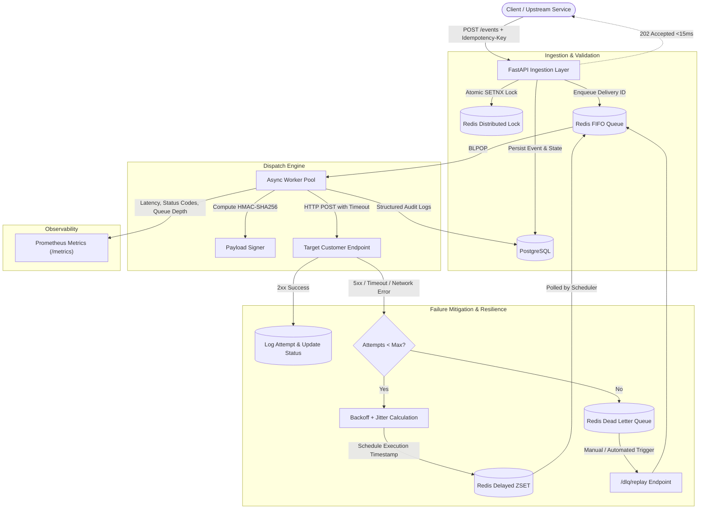

# High-Reliability Distributed Webhook Delivery Platform

A distributed, asynchronous webhook dispatching engine built with Python, FastAPI, Redis, and PostgreSQL. Engineered to guarantee at-least-once delivery semantics, non-blocking ingestion, HMAC-SHA256 payload integrity, exponential backoff with jitter, dead-letter queue (DLQ) isolation, and real-time observability.

---

## Architecture Overview



## Core Technical Highlights

* **Low-Latency Non-Blocking Ingestion:** Ingestion decouples event acceptance from outbound HTTP execution. Requests are validated, idempotency locks are established, and records are written to PostgreSQL before returning an `HTTP 202 Accepted` response within 15ms.

* **Distributed Idempotency Protection:** Implements atomic Redis distributed locks using `SET key value NX EX 86400`, based on unique `Idempotency-Key` headers, to discard duplicate requests before database transactions.

* **Cryptographic Request Signing:** Prevents tamper and replay attacks using canonical JSON serialization and HMAC-SHA256 signatures in the format `t={timestamp},v1={hash}` per subscriber endpoint.

* **Two-Tier Redis Scheduling:** Uses a Redis FIFO list (`webhook:queue:ready`) for immediate dispatch and a Redis Sorted Set (`webhook:queue:delayed`) for delayed retries. A background coroutine moves expired jobs without busy-waiting.

* **Resilience & Thundering Herd Prevention:** Transient failures trigger decorrelated exponential backoff with randomized jitter to protect recovering endpoints from request spikes.

* **Dead-Letter Queue (DLQ) & Safe Replay:** Requests exceeding the retry threshold are isolated in a DLQ to preserve worker capacity. Transactional replay endpoints allow failed tasks to be safely drained and re-queued.

* **Full Operational Observability:** Instrumented with Prometheus counters, gauges, and histograms to track HTTP latency percentiles, error-status distributions, and active queue depth.

---

## Tech Stack

| **Layer**                | **Technologies**                                                                          |
| ------------------------ | ----------------------------------------------------------------------------------------- |
| **Language & Framework** | Python 3.11+, FastAPI, Pydantic v2                                                        |
| **Data Persistence**     | PostgreSQL (ACID event ledger & attempt audit history), SQLAlchemy 2.0 (AsyncIO), asyncpg |
| **Queue & Scheduling**   | Redis 7 (FIFO queues, delayed retry ZSETs, atomic idempotency locks)                      |
| **HTTP Client**          | HTTPX (Async socket transport with strict connection timeouts)                            |
| **Observability**        | Prometheus (`prometheus-client`), structured logging                                      |
| **Infrastructure**       | Docker, Docker Compose                                                                    |

---

## Project Structure

```text
.
├── app/
│   ├── __init__.py
│   ├── config.py          # Environment settings (Pydantic BaseSettings)
│   ├── database.py        # Async SQLAlchemy engine & session factory
│   ├── models.py          # PostgreSQL models (Endpoints, Deliveries, Logs)
│   ├── schemas.py         # Request & response Pydantic schemas
│   ├── security.py        # HMAC-SHA256 signing utilities
│   ├── queue.py           # Redis queue & delayed ZSET operations
│   ├── metrics.py         # Prometheus metrics instrumentation
│   ├── worker.py          # Asynchronous delivery dispatcher & scheduler
│   └── main.py            # FastAPI routes, lifespan hooks, and DLQ replay
├── tests/
│   ├── conftest.py        # In-memory SQLite & Fakeredis test harness
│   └── test_webhook_engine.py
├── docker-compose.yml
├── Dockerfile
├── requirements.txt
└── .env.example
```

---

## Getting Started

### Prerequisites

* Docker & Docker Compose installed
* Git

### 1. Clone & Configure

```bash
Clone the repo using git
cd webhook-delivery-platform
cp .env.example .env
```

### 2. Start Services via Docker Compose

Start the FastAPI application, background workers, PostgreSQL, and Redis:

```bash
docker compose up --build -d
```

### 3. Verify Deployment

Once the services are running:

* **API Documentation (Swagger UI):** http://localhost:8000/docs
* **Prometheus Metrics:** http://localhost:8000/metrics

---

## API Reference

### 1. Register Subscriber Endpoint

**Endpoint:**

```http
POST /endpoints
```

**Request Body:**

```json
{
  "target_url": "https://webhook.site/your-uuid",
  "secret_token": "whsec_live_test_key_xyz"
}
```

---

### 2. Ingest Webhook Event

**Endpoint:**

```http
POST /events
```

**Headers:**

```http
Idempotency-Key: idemp_123456789
```

**Request Body:**

```json
{
  "endpoint_id": "3fa85f64-5717-4562-b3fc-2c963f66afa6",
  "event_type": "invoice.paid",
  "payload": {
    "invoice_id": "inv_9012",
    "amount": 2500,
    "currency": "usd"
  }
}
```

---

### 3. Inspect Delivery & Audit Logs

```http
GET /deliveries/{delivery_id}
```

---

### 4. Drain & Replay DLQ

```http
POST /dlq/replay
```

---

## Running the Automated Test Suite

The test suite runs against an isolated in-memory SQLite database and `fakeredis`, while HTTP network calls are mocked using `respx`.

```bash
# Inside a virtual environment
pip install -r requirements.txt
pip install pytest pytest-asyncio aiosqlite respx fakeredis

# Execute the test suite
pytest tests/ -v
```

---

## Environment Configuration

Create your local environment file from the provided example:

```bash
cp .env.example .env
```

> **Note:** `.env` and `.venv/` should not be committed to version control. Add them to `.gitignore`.

```gitignore
.env
.venv/
```
