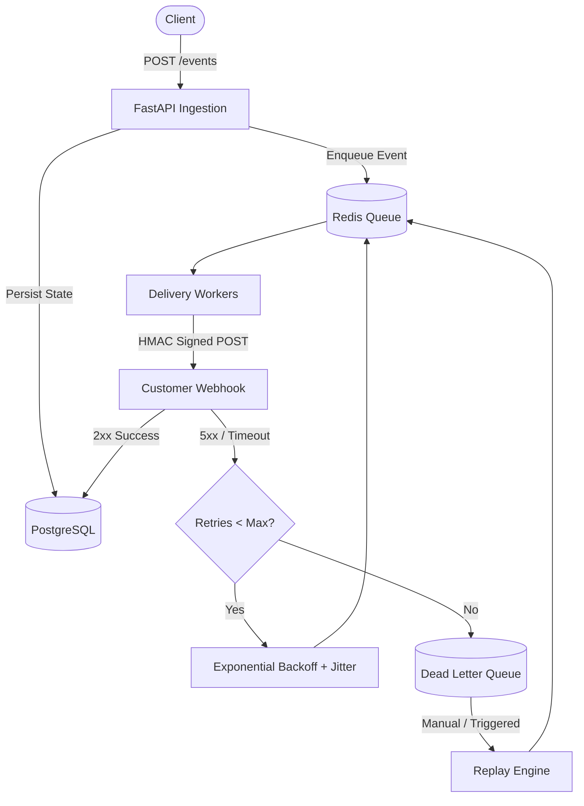

# High-Reliability Webhook Delivery Platform

A distributed, fault-tolerant event dispatch and webhook delivery system designed to reliably deliver customer notifications at scale with at-least-once delivery semantics.

## Architecture Overview



## Key Technical Decisions & Highlights

- **Idempotency Guarantee:** Prevents duplicate event ingestion using unique `Idempotency-Key` headers validated via Redis atomic sets before database persistence.
- **Security & Tamper Prevention:** Payloads are signed via HMAC-SHA256 (`X-Signature-SHA256`) using per-subscriber secret keys for non-repudiation.
- **Resilience & Backoff:** Transient errors trigger exponential backoff with jitter to protect destination servers from thundering herds.
- **Dead Letter Queue (DLQ) & Replay:** Permanently failed webhooks after $N$ attempts are moved to a DLQ, preserving the failure state with full manual and automated replay endpoints.
- **Observability:** Granular delivery attempt logs capture timestamps, request latencies, status codes, and error bodies for end-to-end trace auditing.

## Tech Stack

- **Runtime & API:** Python 3.11+, FastAPI, Pydantic v2
- **Persistence & Storage:** PostgreSQL (delivery state, subscription ledger)
- **Task Queue & In-Memory State:** Redis (worker queues, rate limits, idempotency locks)
- **Environment & Deploy:** Docker, Docker Compose

## Getting Started

```bash
# Clone the repository
git clone [https://github.com/](https://github.com/)<your-username>/webhook-delivery-platform.git
cd webhook-delivery-platform

# Copy environment variables
cp .env.example .env

# Spin up all services (API, Workers, Postgres, Redis)
docker compose up --build -d

# Verify API and inspect interactive OpenAPI docs
open http://localhost:8000/docs
```